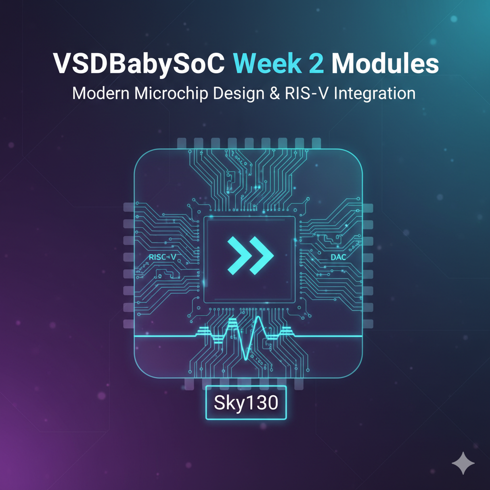

<div align="center">
  <h1>🛠️ VSDBabySoC — Week 2 Learning Modules</h1>
  <p>
    This repository contains **Week 2 educational and practical modules** for the  
    <b>VSDBabySoC</b> — an open-source educational System-on-Chip (SoC) based on the  
    <b>RVMYTH RISC-V core</b> and <b>SkyWater Sky130</b> technology.  
    Explore theoretical concepts, functional modelling, and practical simulations.  
  </p>
    <!-- Badges -->
  
  
  
  
  
  
  
  
</div>
  
  <br/>
  <em>Bridging the gap between SoC fundamentals and functional simulation</em>


---

## 📁 Repository Overview

This repository is divided into two main folders:

| Task | Description | Link |
|------|-------------|------|
| **Task-1** | BabySoC Fundamentals & Functional Modelling (Theory) | [Go to Task-1](./Task-1) |
| **Task-2** | Practical Implementation & Functional Simulation of BabySoC | [Go to Task-2](./Task-2) |

---

## 📖 Table of Contents

| Section | Link |
|---------|------|
| Task-1 Overview | [Task-1 — Fundamentals & Functional Modelling](#task-1-overview) |
| Task-2 Overview | [Task-2 — Practical Implementation & Simulation](#task-2-overview) |
| Learning Outcomes | [Learning Outcomes](#learning-outcomes) |
| Conclusion | [Conclusion](#conclusion) |
| References | [References](#references) |


---

## Task-1 Overview

**Folder:** `Task-1`  

**Focus:** Fundamentals of SoC design and functional modelling concepts.

**Highlights:**
- Understanding **System-on-Chip (SoC)** and its components.
- Types of SoCs: ASIC, FPGA-based, General-purpose, Educational.
- Introduction to **VSDBabySoC** and its RISC-V CPU, PLL, DAC, and memory.
- Importance and role of **functional modelling**.
- Applications in consumer electronics, automotive, IoT, healthcare, and education.
- Learning outcomes for conceptual readiness.

**Folder Contents:**
```bash
Task-1/
├── images/ # Illustrations, banners, diagrams
├── README.md # Task-1 theoretical module
```

> Navigate to the folder: [Task-1](./Task-1)

---

## Task-2 Overview

**Folder:** `Task-2`  

**Focus:** Practical implementation and functional simulation of the VSDBabySoC using **Icarus Verilog, GTKWave, and SandPiper-SaaS**.

**Highlights:**
- Pre-synthesis functional simulation of RISC-V CPU, PLL, and DAC.
- Step-by-step setup and environment preparation.
- TL-Verilog → Verilog conversion of `RVMYTH` CPU module.
- Simulation flow with Icarus Verilog and waveform analysis in GTKWave.
- Observed signals: CLK, CPU data memory, DAC input, DAC output, PLL parameters.
- Key learnings: CPU–DAC linkage, clock synchronization, functional verification.

**Folder Contents:**
```bash
Task-2/
├── src/ # Verilog/TLV modules and testbench
├── images/ # Simulation snapshots, waveform visuals
├── output/ # Simulation output files
```


> Navigate to the folder: [Task-2](./Task-2)

---
## Learning Outcomes

After completing Week 2 — Task-1 & Task-2 modules, learners will be able to:

✅ Explain what a **System-on-Chip (SoC)** is and identify its key components.  
✅ Describe the **types of SoCs** and their applications in real-world systems.  
✅ Understand the **structure and working of VSDBabySoC**, including CPU, PLL, DAC, and memory modules.  
✅ Perform **functional modelling** to verify module behavior before RTL design.  
✅ Set up the **simulation environment** using Icarus Verilog, GTKWave, and SandPiper-SaaS.  
✅ Conduct **pre-synthesis functional verification**, analyzing CPU–DAC linkage and clock synchronization.  
✅ Interpret **waveforms** to confirm proper digital-to-analog conversion and timing stability.  
✅ Relate theoretical SoC concepts to **practical simulation outcomes**.  
✅ Build conceptual readiness for **Week 3 – RTL Modelling and Hardware Simulation**.

---

## Conclusion

The Week 2 modules of **VSDBabySoC** successfully integrate **theoretical foundations** (Task-1) with **practical functional simulation** (Task-2).  

- Task-1 provided a solid conceptual understanding of **SoC fundamentals, component architecture, types of SoCs, and the role of functional modelling**.  
- Task-2 demonstrated **hands-on functional simulation**, verifying CPU, PLL, and DAC interactions through Icarus Verilog and GTKWave.  
- Learners were able to **connect theory with practice**, analyzing digital-to-analog data flow, clock synchronization, and overall SoC behavior.  
- The combined learning ensures readiness for **RTL design, synthesis, and more advanced SoC development tasks**.  

✅ By the end of Week 2, learners can confidently simulate a basic SoC, verify functional correctness, and understand the critical role of functional modelling in hardware design.

---
## References

- 📘 [VSDBabySoC GitHub Repository – Manili](https://github.com/manili/VSDBabySoC)  
- 📗 [RVMYTH RISC-V Core Overview](https://github.com/shivanishah269/riscv-myth)  
- 📙 [SkyWater Sky130 Open-Source PDK](https://skywater-pdk.readthedocs.io/en/main/)  
- 📘 [Fundamentals of SoC Design Notes](https://github.com/hemanthkumardm/SFAL-VSD-SoCJourney/tree/main/11.%20Fundamentals%20of%20SoC%20Design)  

---

<div align="center">
  
  
  
  <br/><br/>
  <em>“Bridging Digital and Analog Worlds through Functional Verification”</em>
</div>
