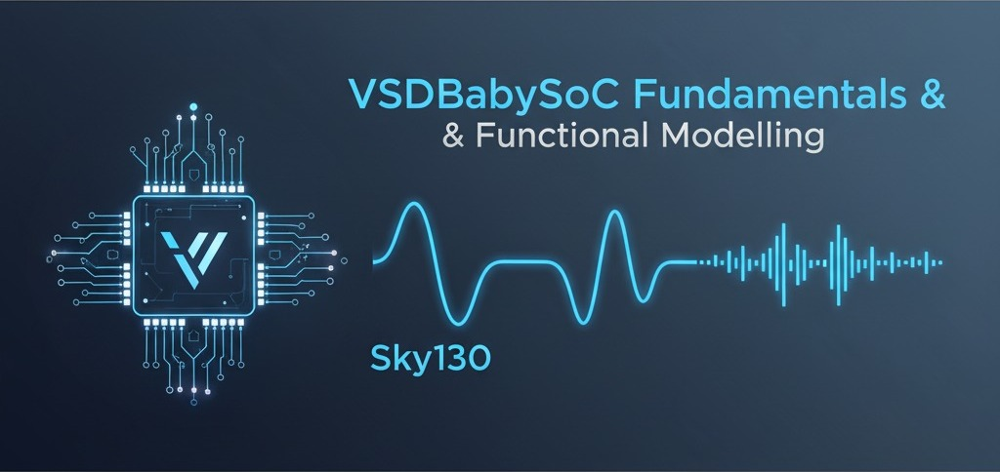
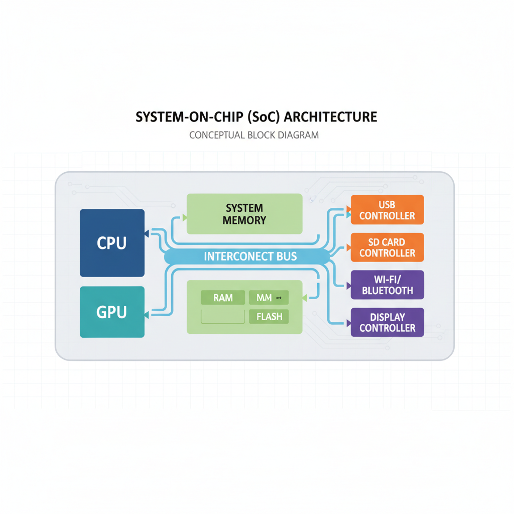
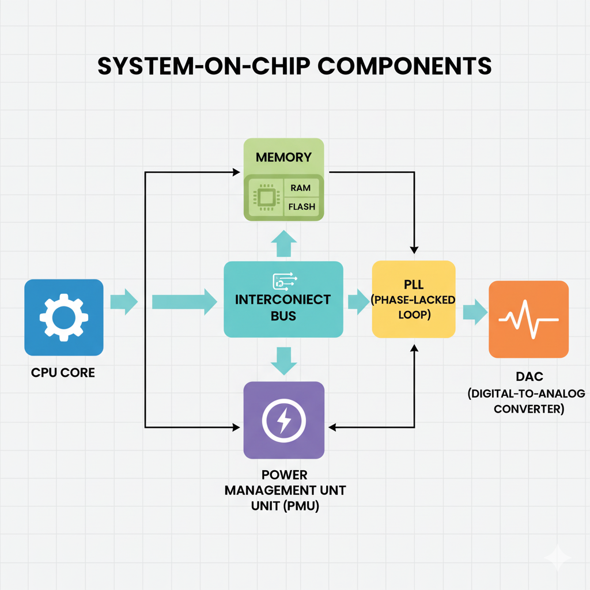

  <h1>🔹 Week 2 — BabySoC Fundamentals & Functional Modelling</h1>
  

    In <b>Week 2</b>, we focus on the <b>Fundamentals of System-on-Chip (SoC) Design</b>  
    and the <b>Functional Modelling Concepts</b> behind the <b>VSDBabySoC</b>.  
    This theoretical module strengthens the understanding of SoC architecture,  
    integration of digital and analog components, and the importance of modelling  
    before RTL implementation or physical design.
  

  
  
  
  

---

## 🗂️ Table of Contents

| S.No | Section Title | Link |
|:----:|----------------|------|
| 1 | 🎯 Objective | [Go to Section](#-objective) |
| 2 | 🧩 Understanding System-on-Chip (SoC) | [Go to Section](#-1-understanding-system-on-chip-soc) |
| 3 | ⚙️ Components of an SoC | [Go to Section](#-2-components-of-an-soc) |
| 4 | 🧠 Types of SoCs | [Go to Section](#-3-types-of-socs) |
| 5 | 🧩 Introduction to VSDBabySoC | [Go to Section](#-4-introduction-to-vsdbabysoc) |
| 6 | 🔬 Role of Functional Modelling | [Go to Section](#-5-role-of-functional-modelling) |
| 7 | 💡 Applications of SoC Design | [Go to Section](#-6-applications-of-soc-design) |
| 8 | 🎓 Learning Outcomes | [Go to Section](#-7-learning-outcomes) |
| 9 | 📚 Reference Materials | [Go to Section](#-reference-materials) |

---

## 🎯 Objective

To develop a strong conceptual foundation in **System-on-Chip (SoC)** design  
and understand how **functional modelling** plays a key role in validating SoC behavior  
before moving to RTL and physical design stages.

---

## 🧩 1. Understanding System-on-Chip (SoC)

A **System-on-Chip (SoC)** is a microchip that combines multiple essential components  
of a computer or electronic system—such as **processor, memory, interconnect, and peripherals—on a single silicon die**.

SoCs are designed for high efficiency, reduced power consumption, and compactness.  
They serve as the backbone of modern embedded systems, enabling advanced processing within minimal space.

### 🔸 Key Features
- Integration of multiple subsystems on one chip.  
- Reduced power consumption and latency.  
- Faster communication through on-chip interconnects.  
- Optimized cost and improved performance.

---

## ⚙️ 2. Components of an SoC

| Component | Description |
|------------|-------------|
| **CPU (Processor Core)** | Executes instructions and controls overall operations. |
| **Memory (ROM/RAM)** | Stores program data and instructions. |
| **Interconnect/Bus** | Connects CPU, memory, and peripherals for data exchange. |
| **Peripherals** | Interfaces such as UART, SPI, GPIO, DAC, etc., that communicate with external devices. |
| **PLL (Phase-Locked Loop)** | Provides clock synchronization and timing accuracy. |
| **Power Management** | Ensures stable operation through regulated voltage and power distribution. |

---

## 🧠 3. Types of SoCs

| Type | Description | Example |
|------|--------------|----------|
| **Application-Specific SoC (ASIC)** | Designed for a dedicated function or product. | MediaTek or Qualcomm chips |
| **General-Purpose SoC** | Configurable for multiple applications. | Raspberry Pi SoC |
| **FPGA-Based SoC** | Combines CPU with programmable logic for flexible design. | Xilinx Zynq |
| **Educational/Research SoC** | Simplified architecture for training and experimentation. | **VSDBabySoC** |

---

## 🧩 4. Introduction to VSDBabySoC

The **VSDBabySoC** is an **open-source educational SoC** created to help learners  
understand SoC structure, functional behaviour, and integration of digital and analog systems.  
It is based on the **RVMYTH RISC-V core**, developed under the **SkyWater Sky130 open-source technology**.

### 🏗️ Key Components
- **RVMYTH Core (RISC-V):** 32-bit processor that executes program logic.  
- **PLL (Phase-Locked Loop):** Maintains clock precision and timing control.  
- **10-bit DAC (Digital-to-Analog Converter):** Converts digital outputs to analog signals.  
- **Bus Interconnect:** Facilitates communication between core, DAC, and memory.  
- **Memory Module:** Stores instructions and operational data.  

### 🧾 Design Purpose
The BabySoC model serves as a **learning platform** that bridges theoretical SoC principles  
with practical hardware design, simulation, and system verification.  

It emphasizes:
- Understanding **processor-peripheral interaction**.  
- Visualizing **clock synchronization** via PLLs.  
- Exploring **digital-to-analog conversion** mechanisms.  

---

## 🔬 5. Role of Functional Modelling

**Functional Modelling** is the first stage in SoC design —  
it focuses on describing the logical behaviour of each module **without implementation details**.

### 🔹 Purpose
- To verify the **functionality** of system components before RTL coding.  
- To ensure **data flow and control signals** work as expected.  
- To detect logical errors early in the design process.  
- To define module interactions and timing dependencies.

### 🔹 Importance
Functional models act as the **conceptual blueprint** of an SoC.  
They simplify complex designs, help simulate system responses, and ensure  
that when RTL design begins, every module behaves correctly at the system level.

---

## 💡 6. Applications of SoC Design

| Domain | Application |
|--------|--------------|
| **Consumer Electronics** | Smartphones, Smart TVs, Cameras |
| **Automotive Systems** | Engine controllers, Infotainment processors |
| **IoT Devices** | Smart sensors, Edge computing modules |
| **Healthcare Systems** | Portable medical devices and monitors |
| **Industrial Automation** | Motor controllers, PLCs |
| **Educational Tools** | Open-source learning platforms like VSDBabySoC |

### 🔸 BabySoC Applications
- Demonstrating RISC-V processor-based system behavior.  
- Studying DAC-based analog output generation.  
- Exploring open-source chip design using Sky130.  
- Building foundation for custom SoC design and verification.

---

## 🎓 7. Learning Outcomes

After completing this theoretical module, learners will be able to:

✅ Explain what a **System-on-Chip** is and identify its components.  
✅ Differentiate between **types of SoCs** based on their application and architecture.  
✅ Describe the **structure and working** of the **VSDBabySoC**.  
✅ Understand the **importance of functional modelling** in SoC development.  
✅ Relate theoretical SoC concepts to **real-world applications** and open-source platforms.  
✅ Build conceptual readiness for **Week 3 – RTL Modelling and Simulation**.

---

## 📚 Reference Materials

- 📘 [Fundamentals of SoC Design – GitHub Notes](https://github.com/hemanthkumardm/SFAL-VSD-SoCJourney/tree/main/11.%20Fundamentals%20of%20SoC%20Design)  
- 📗 [RVMYTH RISC-V Core Overview](https://github.com/shivanishah269/riscv-myth)  
- 📙 [SkyWater Sky130 Open-Source PDK](https://skywater-pdk.readthedocs.io/en/main/)  

---

  <h3>🧡 VSDBabySoC — Learn. Simulate. Innovate.</h3>
  
<i>Building the foundation of open-source SoC design through RISC-V and Sky130 technology.</i>

