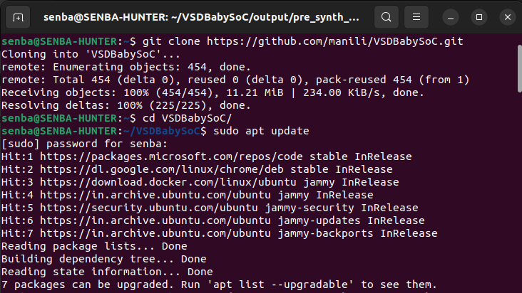
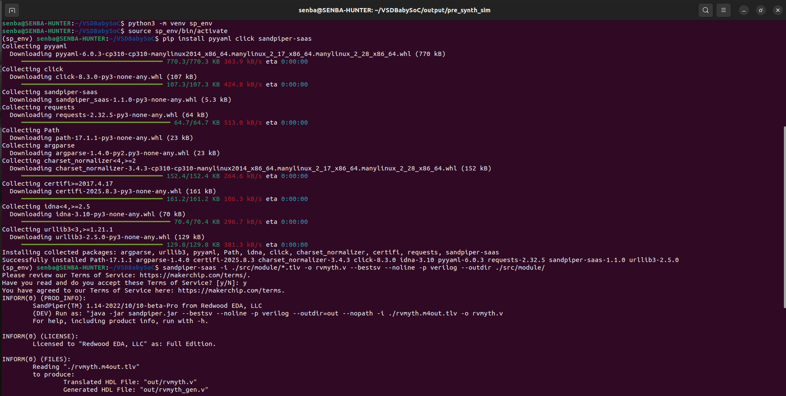
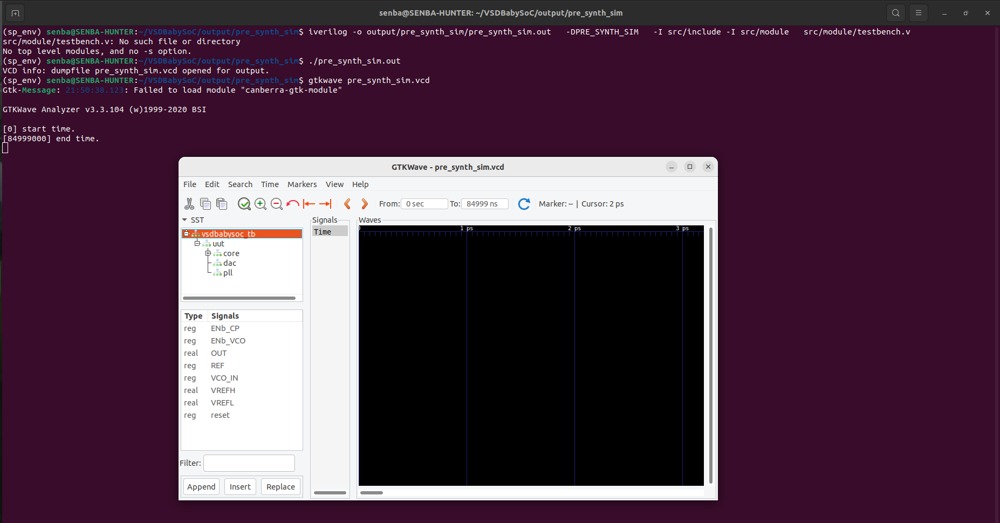
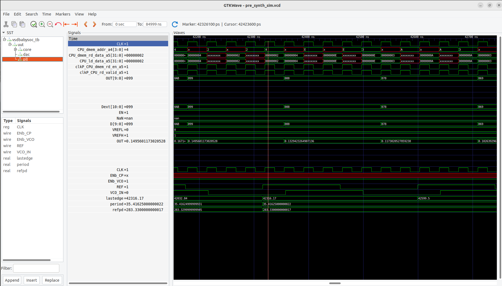

<div align="center">
  <h1>⚙️ Week 2 — Practical Implementation & Functional Simulation of BabySoC</h1>
  <p>
    In <b>Week 2 – Task 2</b>, we focus on the <b>functional verification</b> of the <b>VSDBabySoC</b> design.  
    This stage validates the logical behavior of the <b>RISC-V CPU</b>, <b>PLL</b>, and <b>DAC</b> modules  
    through <b>Icarus Verilog</b> and <b>GTKWave</b> simulation before moving to synthesis or physical design.  
  </p>

  
  
  
  
</div>

---

## 🎯 Objective

To functionally model and verify the **BabySoC** by simulating its key modules —  
the **RISC-V CPU**, **PLL**, and **DAC** — using **Icarus Verilog**, **GTKWave**, and **Yosys**.  
This step confirms correct logic operation before physical design.

---

## 🗂️ Project Structure
```bash
VSDBabySoC/
├── src/
│ ├── include/ # Header and definition files (*.vh)
│ ├── module/ # Verilog + TLV modules
│ │ ├── vsdbabysoc.v # Top-level module
│ │ ├── rvmyth.v # RISC-V CPU
│ │ ├── avsdpll.v # PLL module
│ │ ├── avsddac.v # DAC module
│ │ └── testbench.v # Testbench
├── images/ # Waveform screenshots / visuals
└── output/ # Simulation outputs
```

---

## 🧰 Setup

### 📥 Clone the Repository

```bash
cd ~/VLSI
git clone https://github.com/manili/VSDBabySoC.git
cd VSDBabySoC/
```

<div align="center">
  
  <br/>
  <em>Figure: Repository cloned successfully using <b>git clone</b></em>
</div>

---

### 📁 Repository Contents

Contents after cloning the repository:

- 📂 **src/** → Design sources and testbench files  
- 🖼️ **images/** → Visual references and waveform screenshots  
- 🧾 **output/** → Simulation data and log files  

---

## 🔧 TL-Verilog → Verilog Conversion

The **RVMYTH** CPU module is written in **TL-Verilog (.tlv)** format.  
Before simulation, it needs to be converted to **Verilog HDL (.v)** using the **SandPiper-SaaS** tool.

```bash
# Install dependencies
sudo apt update
sudo apt install python3-venv python3-pip

# Create a virtual environment
python3 -m venv sp_env
source sp_env/bin/activate

# Install SandPiper-SaaS
pip install pyyaml click sandpiper-saas

# Convert TL-Verilog → Verilog
sandpiper-saas -i ./src/module/*.tlv -o rvmyth.v \
  --bestsv --noline -p verilog --outdir ./src/module/
```

<div align="center">
  
  <br/>
  <em>Figure: Python virtual environment setup and SandPiper-SaaS installation</em>
</div>

---

✅ After successful conversion, `rvmyth.v` will be generated inside the `src/module/` directory.  
This file will now be used in the simulation process along with the other Verilog modules.


## 🧪 Simulation Flow
## 🔹 Pre-Synthesis Simulation

```bash
mkdir -p output/pre_synth_sim

iverilog -o output/pre_synth_sim/pre_synth_sim.out \
  -DPRE_SYNTH_SIM \
  -I src/include -I src/module \
  src/module/testbench.v

cd output/pre_synth_sim
./pre_synth_sim.out
```
<div align="center">
  
  <br/>
  <em>Figure: Verilog compilation and simulation executed successfully using <b>Icarus Verilog</b></em>
</div>

---


## 📊 View in GTKWave
```bash
gtkwave output/pre_synth_sim/pre_synth_sim.vcd
```
<div align="center">
  
  <br/>
  <em>Figure: BabySoC functional waveform showing CPU–DAC integration and analog output transition</em>
</div>

## 📊 Waveform Analysis – BabySoC Simulation (pre_synth_sim.vcd)

The following waveform was captured from **GTKWave** during the BabySoC functional simulation.  
It shows the **interaction between the RISC-V core, PLL, and DAC** modules.

---

### 🧩 Observed Signals

| Signal | Description |
|:--------|:-------------|
| **CLK** | Primary clock signal generated by the PLL |
| **CPU_dmem_rd_data** | Data read by the CPU from data memory (used as DAC input) |
| **D[9:0]** | 10-bit DAC input derived from CPU output register `r17` |
| **OUT** | DAC analog output voltage representation |
| **VREFH / VREFL** | DAC reference voltages (High/Low) |
| **EN / NaN** | DAC enable and data-valid control lines |
| **period / refpd** | PLL-generated timing parameters |

---

### ⚙️ Waveform Explanation

From the simulation snapshot:

1. **Clock Behavior (`CLK`)**  
   - The PLL produces a stable periodic clock signal.  
   - Each rising edge synchronizes data movement through the CPU and DAC.

2. **CPU Data Flow (`CPU_dmem_rd_data`)**  
   - Values such as `00000002`, `00000003`, etc., indicate instruction-driven increments.  
   - These represent the RISC-V core performing arithmetic operations and updating memory.

3. **DAC Input (`D[9:0]`)**  
   - The digital input to the DAC transitions smoothly between values (e.g., `099`, `078`, `069`).  
   - This confirms proper data transfer from the CPU to the DAC interface.

4. **Analog Output (`OUT`)**  
   - The `OUT` waveform follows the digital input values proportionally.  
   - For example:
     - When `D = 099`, `OUT ≈ 0.149 V`
     - When `D = 078`, `OUT ≈ 0.132 V`
     - When `D = 069`, `OUT ≈ 0.117 V`
   - The analog level changes correspond to the DAC’s **VREF scaling** and validate correct digital-to-analog conversion.

5. **PLL Operation (`period`, `refpd`)**  
   - The PLL maintains a consistent period of about **35.4 ns**, resulting in stable timing.  
   - The `refpd` (reference phase delay) values show consistent phase locking, confirming PLL stability.

---

### 📈 Key Observations

- ✅ **CPU → DAC linkage verified** — digital data updates are correctly reflected in analog output.
- ✅ **Stable PLL output** — ensures reliable clocking across modules.
- ✅ **Continuous analog transitions** — indicate no glitches or hold violations.
- ✅ **Synchronized timing** between data memory, DAC, and output signals.

---

### 🧾 Summary

This waveform confirms the **successful integration** of the RISC-V CPU, PLL, and DAC modules in the BabySoC.  
The CPU’s data outputs are continuously sampled and converted by the DAC, producing a smooth, analog-equivalent signal (`OUT`).  
The system exhibits stable timing, proper data propagation, and functional synchronization.

---

### 🎯 Key Learnings

1. Functional verification validates **end-to-end data flow** across digital and mixed-signal domains.  
2. The **DAC output** provides real-time insight into CPU arithmetic operations.  
3. **GTKWave analysis** helps identify timing, synchronization, and scaling behavior effectively.  
4. A properly configured **PLL clock** is essential for glitch-free waveform generation.  
5. The **SoC simulation flow** ensures component interaction before physical synthesis.

---

## 🧩 Conclusion

The **VSDBabySoC functional simulation** successfully demonstrates the seamless integration of the **RISC-V core (RVMYTH)**, **PLL**, and **DAC** modules.  
Through waveform verification in **GTKWave**, we validated the SoC’s internal data flow — from instruction execution within the CPU to the final DAC output conversion.  
This confirms that the BabySoC design performs correctly at the **pre-synthesis functional level**, ensuring reliability before moving toward synthesis and physical design.

### ✅ Key Takeaways
- Verified CPU–DAC data transfer using realistic timing behavior.  
- Observed stable **clock generation** and synchronization via PLL.  
- Confirmed accurate **digital-to-analog conversion** and waveform shaping.  
- Established a repeatable **functional simulation flow** using open-source tools:  
  `Icarus Verilog`, `GTKWave`, and `SandPiper-SaaS`.  
- Gained hands-on understanding of how an SoC’s digital and analog blocks interact before layout design.

---

## 📚 References

- [🔗 VSDBabySoC GitHub Repository – Manili](https://github.com/manili/VSDBabySoC)  
- [📘 RISC-V Core Design – Shivani Shah (VSD)](https://github.com/shivanishah269/risc-v-core)  
- [🧠 SoC Fundamentals – Hemanth Kumar (VSD)](https://github.com/hemanth-kumar-vsd)  
- [🛠️ VSD SoC Journey – Spatha (Day 5)](https://github.com/spathadev/vsdsoc-day5)  
- [⚙️ SkyWater 130nm PDK – Open Source PDK](https://github.com/google/skywater-pdk)  

---

<div align="center">
  
  
  
  <br/><br/>
  <em>“Bridging Digital and Analog Worlds through Functional Verification”</em>
</div>

---


